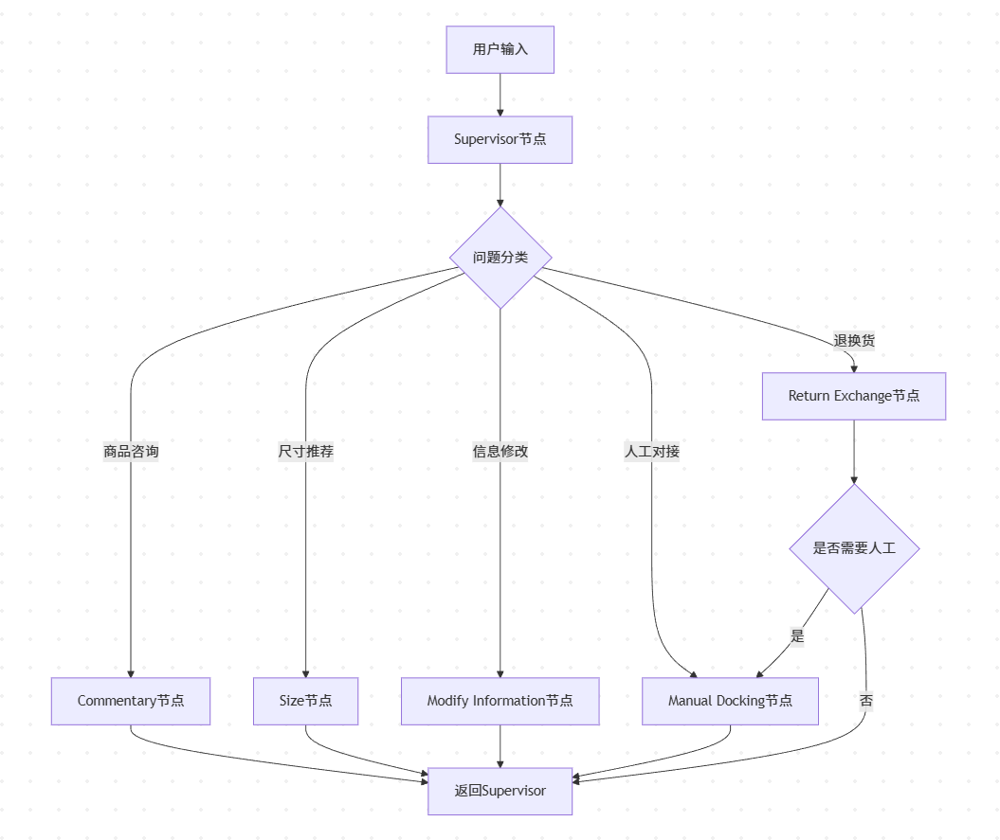
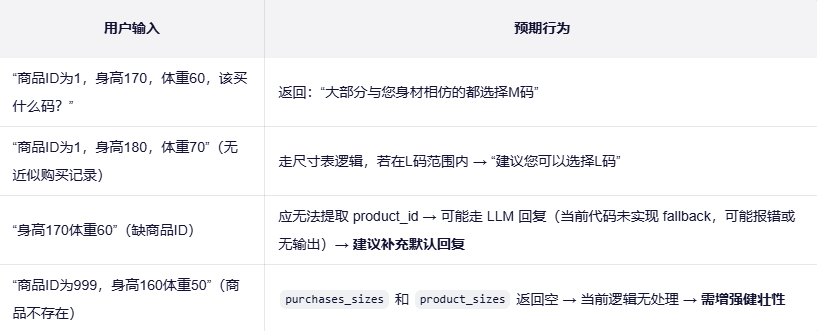
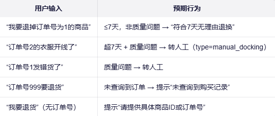
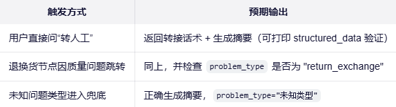

# 🤖 电商智能客服系统

<p align="center">
  
</p>

<p align="center">
  <strong>基于大语言模型（LLM）和 LangGraph 构建的智能客服解决方案</strong>
</p>

<p align="center">
  <a href="#功能特性">功能特性</a> •
  <a href="#技术架构">技术架构</a> •
  <a href="#快速开始">快速开始</a> •
  <a href="#扩展开发">扩展开发</a>
</p>

---

## 📋 项目简介

这是一个基于大语言模型（LLM）和 LangGraph 构建的电商智能客服系统，能够自动识别用户问题类型并提供相应的自动化服务。系统集成了商品咨询、尺寸推荐、退换货处理等功能，能够在大多数情况下自动处理客户问题，并在需要时智能转接到人工客服。

### ✨ 核心优势

- **智能分类** - 准确识别用户问题类型并路由到相应处理模块
- **自动化处理** - 大部分常见问题无需人工干预即可解决
- **无缝切换** - 复杂问题可平滑转接到人工客服
- **高度可扩展** - 模块化设计，易于添加新功能

## 🚀 功能特性

### 1. 智能问题分类

系统能够自动将用户问题分为以下五类：

- `commentary`: 商品咨询
- `size`: 尺寸推荐
- `return_exchange`: 退换货处理
- `modify_information`: 订单信息修改
- `manual_docking`: 人工客服对接

### 2. 商品咨询服务

- 查询特定商品属性信息
- 搜索具有特定属性的商品

### 3. 智能尺寸推荐

- 基于用户身高体重推荐合适的商品尺码
- 提供历史购买数据统计分析推荐
- 结合商品规格表和用户身材进行个性化推荐

### 4. 退换货处理

- 自动判断是否符合7天无理由退换条件
- 识别质量问题并智能转接人工客服
- 提供退换货政策说明

### 5. 人工客服智能对接

- 自动生成问题摘要便于人工客服快速了解情况
- 结构化存储关键信息用于后续处理
- 平滑的机器人到人工的交接体验

## ⚙️ 技术架构

系统采用 LangGraph 构建工作流，主要包含以下几个节点：

### 系统组件

1. **Supervisor节点** - 负责问题分类和任务分发
2. **专用处理节点** - 针对不同类型问题的专业处理器
3. **数据库层** - 存储商品信息、用户数据和历史记录
4. **LLM引擎** - 提供自然语言理解和生成能力

## 🛠 快速开始

### 安装依赖

```bash
pip install langchain langgraph pymysql python-dotenv
```

### 环境配置

#### 1. API 密钥配置

创建 `.env` 文件并添加智谱AI API密钥：

```env
ZHI_PU_API_KEY=your_api_key_here
```

#### 2. 数据库配置

在 [main.py](./main.py) 中修改 `DB_CONFIG`：

```python
DB_CONFIG = {
    'host': 'localhost',
    'database': 'shop_db',
    'user': 'your_username',
    'password': 'your_password'
}
```

### 数据库结构

系统需要以下数据库表：

#### 1. 商品属性表 (`product_attributes`)

| 字段 | 类型 | 描述 |
|------|------|------|
| product_id | INT | 商品ID |
| attribute_key | VARCHAR | 属性键（如颜色、款式等） |
| attribute_value | VARCHAR | 属性值 |

#### 2. 商品购买记录表 (`product_purchases`)

| 字段 | 类型 | 描述 |
|------|------|------|
| id | INT | 订单ID |
| product_id | INT | 商品ID |
| size_code | VARCHAR | 尺码代码 |
| height | INT | 购买者身高 |
| weight | INT | 购买者体重 |
| purchase_date | DATETIME | 购买日期 |
| status | VARCHAR | 订单状态 |
| return_item | BOOLEAN | 是否退货 |

#### 3. 商品尺寸信息表 (`product_sizes`)

| 字段 | 类型 | 描述 |
|------|------|------|
| product_id | INT | 商品ID |
| size_code | VARCHAR | 尺码代码 |
| height_range | VARCHAR | 适合身高范围 |
| weight_range | VARCHAR | 适合体重范围 |
| stock | INT | 库存数量 |

## ▶️ 使用方法

运行主程序：

```bash
python main.py
```

系统会启动一个演示流程，展示如何处理用户问题。

### 示例对话

<p align="center">
  
  
  
</p>

## 🧠 工作原理

1. **问题分类**: Supervisor节点使用LLM对用户输入进行分类，确定问题类型
2. **任务处理**: 根据分类结果，将请求路由到相应的处理节点
3. **信息检索**: 各个处理节点通过数据库查询或LLM工具获取相关信息
4. **结果生成**: 构造友好的客服回复返回给用户
5. **智能转接**: 对于复杂问题，系统会自动生成摘要并转接人工客服

## 🧩 扩展开发

可以通过以下方式扩展系统功能：

1. 添加新的问题分类节点
2. 集成更多第三方工具和服务
3. 改进现有的提示词模板
4. 增加更多的业务逻辑处理
5. 实现Web界面或API接口

## ⚠️ 注意事项

- 确保数据库连接正常且表结构正确
- 智谱AI API密钥需要有效且有足够的余额
- 根据实际业务需求调整分类逻辑和响应模板
- 系统目前使用InMemorySaver作为检查点，生产环境建议替换为持久化存储

## 📄 许可证

本项目仅供学习交流使用。